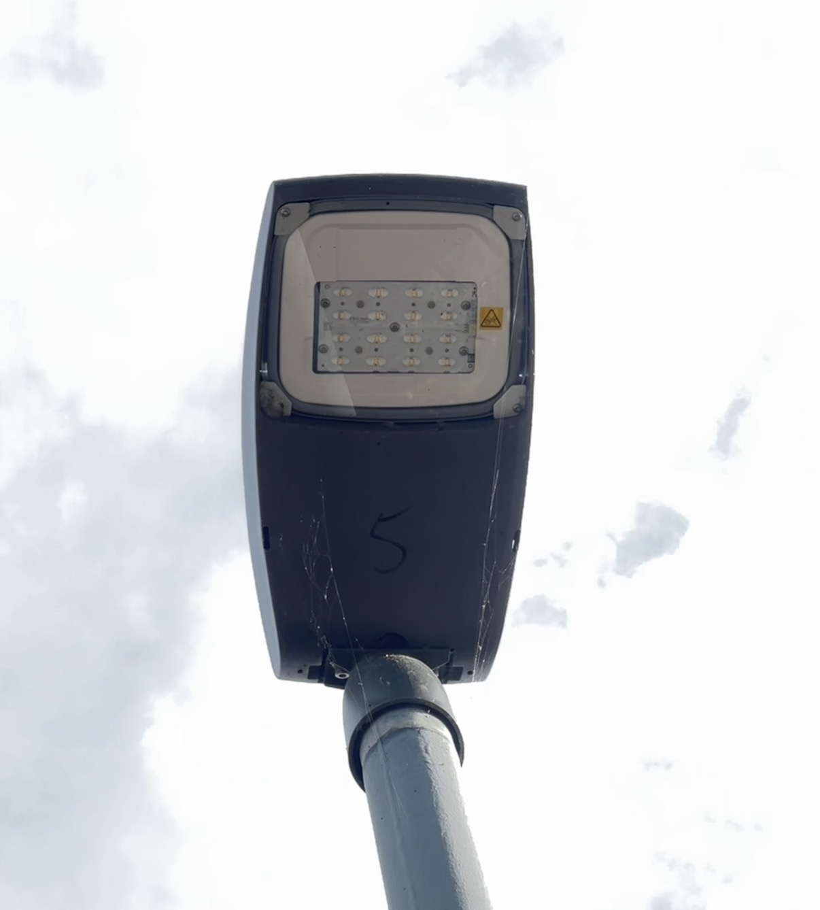

# Schreder Teceo S BLE Reverse Engineering

Reverse engineering the BLE interface of the Schreder Teceo S street lamp to enable custom dimming control.

---

## Target Hardware



- **Lamp:** Schreder Teceo S
- **BLE Controller:** LG Innotek (`LGIT_PISEA040X`) with custom Schreder firmware
- **BLE Advertised Name:** `LGIT_PISEA040X_XXXX` (last 4 digits vary per device)
- **Official App:** Schreder Sirius — not publicly available for download
- **Accessory:** qEnergy BLE Dongle (used by the Sirius app)

---

## BLE Connection Behavior

- Scanning apps (e.g. nRF Connect, BT Inspector) trigger a pairing request from `SCHREDER BLE` within seconds of connecting.
- After pairing, there is a **5–10 second window** to send a command. If nothing is sent, the controller disconnects and **refuses new connections** until the device is removed from the OS paired devices list.
- After sending any command to characteristic `0x1013`, the connection drops immediately. On reconnect (without re-pairing), the connection stays open for up to **30 seconds**.

---

## BLE Services & Characteristics

> **Note:** All MAC addresses in this document are censored.

### Normal mode (after pairing)

```
[SERVICE] 00001016-d102-11e1-9b23-00025b00a5a5
  ├── [CHAR] 0x1011  Properties: read          — OTA firmware version
  ├── [CHAR] 0x1013  Properties: read, write   — Operating mode / app select
  ├── [CHAR] 0x1014  Properties: read, notify  — Data Transfer (CS block responses)
  └── [CHAR] 0x1018  Properties: write         — CS block read/write commands

[SERVICE] 0x1800  (Generic Access)
  ├── [CHAR] 0x2A00  — Device Name
  └── [CHAR] 0x2A01  — Appearance

[SERVICE] 0x180A  (Device Information)
  ├── [CHAR] 0x2A24  — Model Number
  ├── [CHAR] 0x2A25  — Serial Number
  ├── [CHAR] 0x2A26  — Firmware Revision
  ├── [CHAR] 0x2A27  — Hardware Revision
  ├── [CHAR] 0x2A28  — Software Revision
  ├── [CHAR] 0x2A29  — Manufacturer Name
  └── [CHAR] 0x2A50  — PnP ID

[SERVICE] 00005403-d102-11e1-9b23-00025b00a5a5
  └── [CHAR] 0x5404  Properties: write-without-response, notify — Serial / dimming commands
```

### OTA Update mode (after sending `0x00` to `0x1013`)

BLE name changes to `LGIT_OTA_Update`. Additional services appear. Dimming commands over `0x5404` are **silently ignored** in this mode.


```
[SERVICE] 00001010-d102-11e1-9b23-00025b00a5a5  — 3 characteristics
  ├── [CHAR] 0x1015  Properties: read, notify
  ├── [CHAR] 0x1017  Properties: notify
  └── [CHAR] 0x1019  Properties: read            — value: 7.0.0.9

[SERVICE] 00001016-d102-11e1-9b23-00025b00a5a5  — 4 characteristics  (same as normal mode)
  ├── [CHAR] 0x1011  Properties: read            — OTA Version: 6
  ├── [CHAR] 0x1013  Properties: read, write     — Current App: 1
  ├── [CHAR] 0x1014  Properties: read, notify
  └── [CHAR] 0x1018  Properties: write

[SERVICE] 00005403-d102-11e1-9b23-00025b00a5a5  — 1 characteristic
  └── [CHAR] 0x5404  Properties: write-without-response

[SERVICE] Battery Service
  └── [CHAR] Battery Level  — value: 100
```

---

## Operating Modes (0x1013)

Writing a single byte to `0x1013` switches the operating mode. The connection drops immediately after each write.

| Value | Effect |
|-------|--------|
| `0x00` | Switch to OTA Update mode — BLE name changes to `LGIT_OTA_Update`, additional characteristics appear on next connect |
| `0x01`–`0x04` | Assumed to select operating mode / application slot (unconfirmed) |

---

## Dimming (0x5404)

Write up to **4 bytes** (`XX XX XX XX`) to characteristic `0x5404`:

| Byte | Role | Notes |
|------|------|-------|
| Byte 0 | Command | `0x01` = set brightness |
| Byte 1 | Brightness | `0x32` = 50%, scale appears to be 0–100 decimal |
| Bytes 2–3 | Unknown | No visible effect observed regardless of value; byte 3 must stay ≤ `0x14` (20) or the command is rejected |

**Example:** `01 32` → dims lamp to 50%

**Known issue:** The dimming effect is **temporary (~2 seconds)**. The lamp returns to 100% shortly after. The lamp under test normally boots at ~75% brightness; after any dimming command it resets to 100% permanently for that session.

---

## Configuration Store (CS Block Dump)

The firmware stores configuration in a flat binary region, readable in 20-byte blocks via `0x1018`. Responses arrive as notifications on `0x1014`.

**Read protocol:** Write `[offset_lo offset_hi length_lo length_hi]` to `0x1018`.  
**Example:** `00 00 14 00` → read 20 bytes from offset 0.

Reading beyond offset `0x3C` (60) returns a GATT `UNLIKELY_ERROR (0x0E)`.

**OTA Version** (`0x1011`): `06`  
**Current App** (`0x1013`): `01`

### Raw dump (120 bytes)

```
0000: 54 00 XX XX XX XX XX XX 20 00 00 00 00 00 00 00  |T....... .......|
0010: 00 00 00 00 00 00 00 00 00 00 00 00 28 00 00 00  |............(...|
0020: 06 00 FF F7 E5 3F FF FF FF 3F 30 75 98 3A 00 00  |.....?...?0u.:..|
0030: 9D 00 0F 00 09 00 0A 00 00 00 00 00 00 00 00 00  |................|
0040: 00 00 00 00 00 00 00 00 00 00 00 00 0A 00 0F 80  |................|
0050: 44 47 6D 09 35 0A 34 08 00 41 40 00 00 10 01 00  |DGm.5.4..A@.....|
0060: D0 07 10 27 00 00 38 FF E2 04 06 FF FD 0A 05 00  |...'..8.........|
0070: 00 00 00 00 00 00 00 00                          |........|
```

_MAC bytes at offset 0x02–0x07 are censored (`XX`)._

---

## CS Block Analysis (AI-generated — treat as guesses)

### Block 0 — offset 0x0000 (Bluetooth Identity)

```
54 00 XX XX XX XX XX XX 20 00 00 00 00 00 00 00 00 00 00 00
```

| Bytes | Value | Interpretation |
|-------|-------|----------------|
| `54 00` | 0x0054 = 84 | CS Key: `PSKEY_BDADDR` (Bluetooth address) |
| `XX XX XX XX XX XX` | `XX:XX:XX:XX:XX:XX` | BT MAC address — matches target device MAC ✅ |
| Rest | `00` | Padding |

### Block 1 — offset 0x0014 (System Parameters)

```
00 00 00 00 00 00 00 00 00 00 00 00 28 00 00 00 06 00 FF F7
```

| Bytes | Value | Interpretation |
|-------|-------|----------------|
| `28 00` | 40 | Likely timeout or period (40 × something) |
| `06 00` | 6 | OTA Protocol Version 6 — matches `ota_version: "06"` ✅ |
| `FF F7` | — | Bitmask, likely feature flags (almost all bits set) |

### Block 2 — offset 0x0028 (Calibration / Timing)

```
E5 3F FF FF FF 3F 30 75 98 3A 00 00 9D 00 0F 00 09 00 0A 00
```

| Bytes | Value | Interpretation |
|-------|-------|----------------|
| `E5 3F` | 16357 | Likely crystal trim (`PSKEY_ANA_FREQ` or similar) |
| `FF FF FF 3F` | — | Bitmask / feature register |
| `30 75 98 3A` | — | Likely calibration value (32-bit float ≈ 0.000293 if IEEE 754) |
| `9D 00` | 157 | Possible threshold value |
| `0F 00` | 15 | Possible parameter (max level?) |
| `09 00` | 9 | Parameter |
| `0A 00` | 10 | Possible current dim level = 10% |

### Block 3 — offset 0x003C (empty)

```
00 00 00 00 ... (all zeros)
```

No data — either unused or cleared.

### Block 4 — offset 0x0050

```
00 00 00 00 00 00 00 00 00 00 00 00 0A 00 0F 80 44 47 6D 09
```

| Bytes | Value | Interpretation |
|-------|-------|----------------|
| `0A 00` | 10 | Dim power-on level = 10% — persistently stored ✅ |
| `0F 80` | — | Possible min/max level with flag bit |
| `44 47 6D 09` | `DGm\t` | Possible firmware ID or serial (ASCII: `DGm` + 0x09) |

### Block 5 — offset 0x0064 (DALI Configuration)

```
35 0A 34 08 00 41 40 00 00 10 01 00 D0 07 10 27 00 00 38 FF
```

| Bytes | Value | Interpretation |
|-------|-------|----------------|
| `35 0A` | 53, 10 | DALI parameter + level 10 |
| `34 08` | 52, 8 | DALI fade time / address |
| `41 40` | — | DALI flags |
| `D0 07` | 2000 | Likely fade time in ms (**2 seconds**) |
| `10 27` | 10000 | Likely period in ms (10 seconds) or frequency |
| `38 FF` | — | DALI limits |

### Block 6 — offset 0x0078

```
E2 04 06 FF FD 0A 05 00 00 00 00 00 00 00 00 00 00 00 00 00
```

| Bytes | Value | Interpretation |
|-------|-------|----------------|
| `E2 04` | 1250 | Likely PWM frequency (1250 Hz) |
| `06 FF` | — | Version + flags |
| `FD 0A` | 253, 10 | DALI max value + level 10 |
| `05 00` | 5 | Parameter (min level?) |

---

## CS Write Attempt

A modified config was written back, changing the fade time at offset `0x6C` from `D0 07` (2s) to `40 1F` (8s). The write was accepted across all 7 blocks with no errors. However, a subsequent CS dump showed **no change** — the value at `0x6C` remained `D0 07`.

**Write protocol:** Write 20-byte blocks with `[offset_lo offset_hi 14 00]` to `0x1018`. After all blocks, send `0x07` then `0x05` to `0x5404` as an apply/save signal.

The CS read-back after writing echoes back the original data, suggesting either:
- Writes are accepted but not committed without an additional trigger
- This address range is read-only in the current app slot
- The apply signal (`0x05`) is not the correct save command

---

## Open Questions

- What is the correct save/commit sequence after a CS write?
- What do bytes 2–3 of the dimming command (`0x5404`) control?
- How is persistent dimming (not just a 2-second override) triggered?
- What do operating modes `0x01`–`0x04` on `0x1013` actually do?
- What do the new OTA-mode characteristics (`0x1015`, `0x1017`, `0x1019`) expose?
- What is the complete CS block layout beyond the identified fields?

---

## Tools Used

- **nRF Connect / BT Inspector** — BLE scanning and characteristic interaction
- **Bleak (Python)** — scripted BLE communication
- **Raspberry Pi** — test platform

## Files

| File | Description |
|------|-------------|
| `ble information/after_pairing_scan.png` | BLE scan after pairing (normal mode) |
| `ble information/ota_scan.png` | BLE scan in OTA mode |
| `config/schreder_deep_test.py` | Python script for CS dump and BLE tests |
| `config/write_config.py` | Python script for CS write attempt |
| `config/schreder_deep_csdump_20260405_011915.json` | Raw CS dump output |
| `config/scan_cmd_output.txt` | Terminal output of CS read |
| `config/write_cmd_output.txt` | Terminal output of CS write |
| `config/after_write_csdump.txt` | CS dump after write (unchanged) |
| `product sheets/` | Datasheets: Teceo S, driver, BLE chip, BLE dongle, Sirius app |
